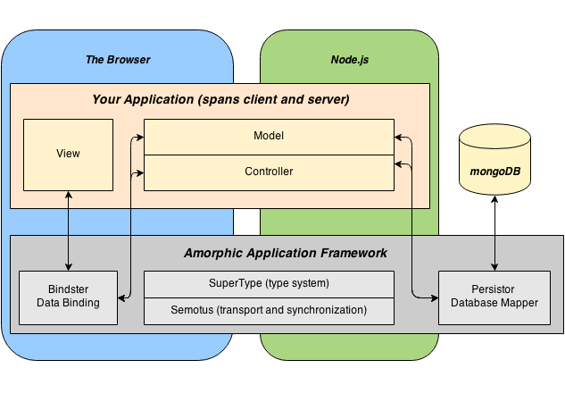

### Welcome to Amorphic

Amorphic is a full-stack, isomorphic framework for creating web-based applications with Node.js and MongoDb.

The goal of Amorphic is to let you focus on the logic of your application with minimal regard for:

* Where code executes - browser to server transitions are seamless
* How data is mapped to the database - objects and their relationships persisted
* Dealing with the DOM - two way data binding replaces traditional templates

### Closely Coupled Browser and Server

Web-based applications usually follow one of two paradigms.  Either applications posted data to the server and in response a new page was returned to the browser or a single page makes xhr calls to the server which will return data.  Amorphic is a refinement of the second paradigm for object-oriented applications.

Each instance of an object lives both in the browser and on the server.  Each method is configured to have it's implementation on the server or the browser and one can call any method without regard to where it lives. Under the covers Amorphic will setup an xhr call AND synchronize the entire object graph so that the state of your application is up-to-date before the method executes.  

The upshot is that you have to do nothing special to execute methods on the server directly from the browser and to the extent that the data you need is a
part of your objects you need to do nothing special to pass data back and forth.

As a front-to-back platform you need other tools to create functional applications:

- Data binding to bind the page to and from your perfectly synchronized objects

- A persistence mapper to store your objects to and fetch them from a mongoDB database

- A session-based container to serve up the application and keep every user's objects independent

### Cascading Persistence

The persistence model in Amorphic is simple.  Your model defines the relationships between objects (one-to-many and many-to-one), you create your object graph using normal references and arrays (for one-to-many) and then when you save, Amorphic walks through graph and saves what it has to. Then when you retrieve objects, Amorphic will fetch all referenced objects either immediately or upon request.

You need to define what object templates belong in what document collections and what object templates are sub-documents.  You also need to define foreign-key references but you don't have to have a property-level schema.  

### Model, View, Controller

Amorphic is built on a model, view, controller paradgym

* **Model** - Amorphic make it possible to create rich object models that are easily persisted with minimal schema information.
 
* **View** - Is the HTML adorned with data-bind attributes and augmented by special HTML tags (similar to directives in Angular) that give you iteration and conditional constructs.

* **Controller** - In Amorphic there is one main controller that is at the root of the application and is essentially a session for a single user. You may compose more granular controllers to keep things modular.  The main controller is the scope for data binding in the view.

### Session Oriented
 
 Each web browser session gets it's own session and it's own "object space".  That is all object instances are unique to a user's session.  You cannot share objects between sessions.  If you want to share data across multiple users this is done via a cache (REDIS) or the database.  This ensures that as you scale your application past a single server you won't have created dependencies on two sessions living on the same physical server.
 
 Amorphic manages sessions using Connect and it's session semantics.  This means that if you configure Redis as your session store you can load balance across multiple servers.  Amorphic is optimized for sticky sessions.  
  

